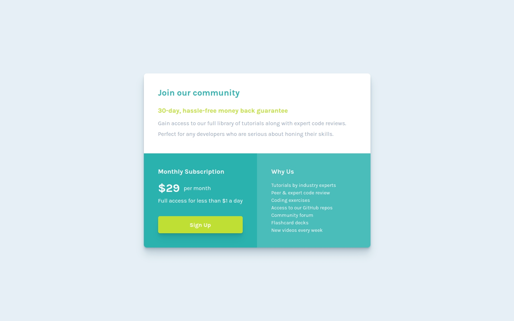

# Frontend Mentor - Single price grid component solution

This is a solution to the [Single price grid component challenge on Frontend Mentor](https://www.frontendmentor.io/challenges/single-price-grid-component-5ce41129d0ff452fec5abbbc). Frontend Mentor challenges help you improve your coding skills by building realistic projects.

## Table of contents

- [Overview](#overview)
  - [The challenge](#the-challenge)
  - [Screenshot](#screenshot)
  - [Links](#links)
- [My process](#my-process)
  - [Built with](#built-with)
  - [Thoughts](#thoughts)
  - [Useful resources](#useful-resources)
- [Author](#author)

## Overview

### The challenge

Users should be able to:

- [x] View the optimal layout for the component depending on their device's screen size
- [x] See a hover state on desktop for the Sign Up call-to-action

### Screenshot

### Links

- Solution URL: https://www.frontendmentor.io/solutions/single-price-grid-component-built-with-html-and-css-egDilv-lg1
- Live Site URL: https://joshjavier.github.io/single-price-grid-component/

## My process

### Built with

- Semantic HTML5 markup
- CSS custom properties
- Flexbox
- CSS Grid
- Mobile-first workflow

### Thoughts

I almost used PostCSS to keep the CSS organized, but for now I decided to keep this solution as simple as possible since I'm only making a single component in isolation. Aside from adding a package dependency, that approach would also add an unnecessary compile step for the CSS.

For the responsive layout, I used the [Font-size Clamp Generator](https://clamp.font-size.app/) to use `clamp()` for font sizes and paddings that scale with the viewport, thus removing the need for media queries.

### Useful resources

- [Font-size clamp() generator](https://clamp.font-size.app/)
- [CSS Shadow Palette Generator](https://www.joshwcomeau.com/shadow-palette/)

## Author

- Website - [Josh Javier](https://joshjavier.com/)
- Frontend Mentor - [@joshjavier](https://www.frontendmentor.io/profile/joshjavier)
